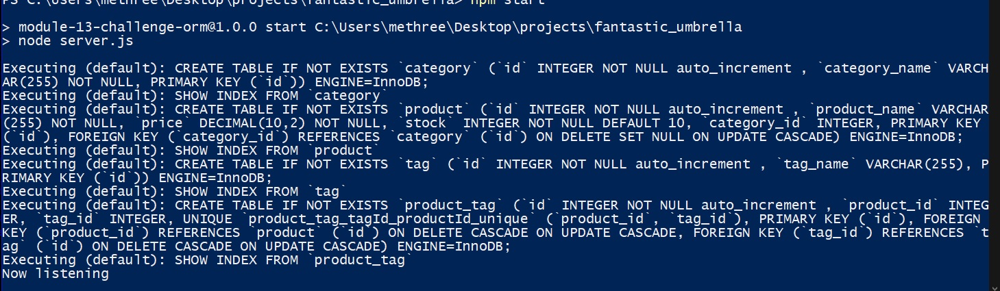

 

  <h1 align="center">Fantastic Umbrella Database API</h1>

## Description 

This is a specialized database API with a specific use case. it is used to view, delete or modify existing data or add new data.

## Table of Contents

* [Usage](#usage)
* [Contributing](#contributing)
* [Tests](#tests)
* [License](#license)
* [Questions](#questions)
* [Links](#links)

## Usage 

Once all dependencies have been installed it can be run by first sourcing the schema with the MYsql shell then running the seed script NPM RUN SEED then starting the server via NPM START.  Inputs and output routes can be used via insomnia.

## Contributing

No contributions at this time please, but your are free to use this code in your own project given the license listed below.

## Tests

I welcome any tests or suggestions to better this project in the future.

## License

This project is covered under the MIT license.

## Questions

I can be contacted via email or on github at:

* E-mail: johntaylorwoodland@gmail.com
* Github: https://github.com/jondagamkd/

## Links

The video can be seen [HERE](https://watch.screencastify.com/v/uNhla4bSKT4VkMzCRSfg/)

